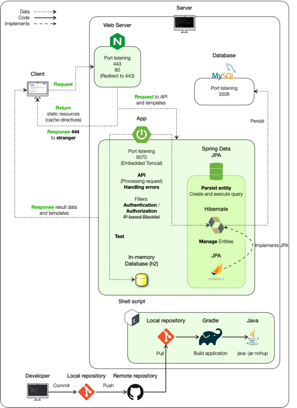
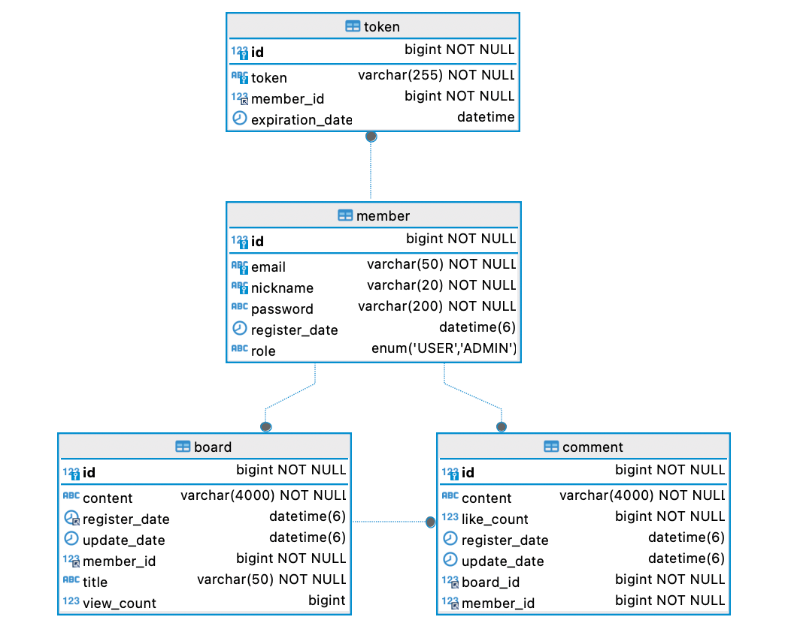
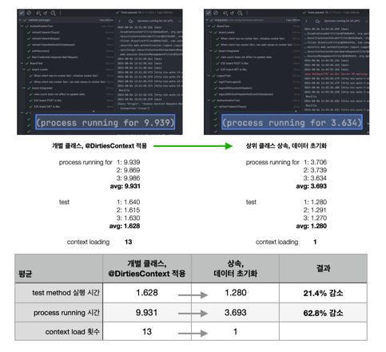

> 문서 업데이트: 2024-08-06 

소개 <small>(Intro)</small>
---
회원, 인증, 게시물, 댓글 기반 게시판 서비스로, 개인 프로젝트입니다.   
REST 구조에 따라 API 를 설계, 구현했습니다.   
2024.02 - 현재 진행 중.   
[서비스 이용해 보기](https://flyin-heron.duckdns.org)

사용 기술 <small>(Skills)</small>
---
* Language: Java, JavaScript
* Framework: Spring Boot, Spring Data JPA, 
* Database: MySQL
* Web Server: Nginx
* View: HTML, CSS, BootStrap

구조 <small>(Architecture)</small>
---

개체간 관계도 <small>(ERD)</small>
---

기능 <small>(Features)</small>
---

### Application

##### Entity

* 회원 <small>member</small>
  - 가입, 로그인
    - 가입 시, 각 `<input>` 유효성 검사.   
    - 모든 조건을 만족하는지 사용자 입력마다 반응해 `<submit>` 활성화. (서버에서 2차 검증)
  - 게시물, 댓글 '조회' 외의 기능에 대한 인가. `@PreAuthorize`
  
* 토큰 <small>token</small>
  - 매일 특정 시간에 Database 조회, 만료된 Refresh token 삭제 및 로그아웃 처리.
  - 인가가 필요한 end-point 요청 시, 헤더에 Access token 을 담아 요청.
    - 만료되지 않은 경우, 인가 및 요청 처리.
    - 만료된 경우 ,리프레시 토큰으로 재요청, Database 조회,
      - 유효한 Refresh token 이고,
        - 이 토큰의 만료시점 까지 7일 넘게 남았다면 Access token 재발급.
        - 7일 이내이면 Access / Refresh token 재발급.  
  
* 게시물 <small>board</small>
  - 목록 페이지네이션 (`Page`).
  - 등록, 조회, 수정, 삭제.
  - 쿠키 기반 조회수 관리.
  
* 댓글 <small>comment</small>
  - 목록 더 불러오기 (`Slice`).
  - 등록, 조회, 수정, 삭제.
  - ~~좋아요 기능~~(추가 예정)

##### Global

* 예외 처리
  - 서비스 중 일어날 수 있는 예외를 대비해, 상황에 알맞는 HTTP 상태 코드와 메시지를 본문에 담아 응답.    
  ---> 정상 응답 `DTO` 에도 포함 된 필드로, 프론트 측 서버 API 호출 메서드 재사용에 효과적.

* 필터 계층
  - WAS 로 향하는 HTTP 요청 로깅.
  - JWT 인증 시 일어날 수 있는 `JwtException` 처리하는 객체 등록.

### Web Server

##### Nginx
* 요청 헤더 `User-Agent`, `Connection` 기반 최소한의 무차별 / 비정상 요청에 `444` 상태 코드 응답.
* 정적 자원 `Cache-Control` 지시 및 반환.
* 서버로 향하는 모든 접근 로깅.

테스트 <small>(Test)</small>
---
Controller, Service, Repository 계층별 / 통합 테스트. 다음의 경우에 유용하게 사용 중입니다.

* 기능 도입 시 확실하지 않은 부분의 확인.
* 기능 구현, 리팩토링 후, 의도대로 작동하는 지 확인.

공유 가능한 애너테이션, 인스턴스, 필드, 테스트 데이터를 효율적으로 관리하고자
* 각 계층별 상위 클래스 선언, 상속을 통해 테스트 중입니다.

`@SpringBootTest` 애너테이션의 경우, `SpringBootTest.WebEnvironment.RANDOM_PORT`로 지정한 여러 테스트를 묶어 실행할 때, 
테스트 마다 Bean 으로 등록된 인스턴스를 `final`로 선언하더라도 컨텍스트 로딩 시 등록한 인스턴스를 공유하는 것을 알 수 있었습니다.   
이에 스프링의 구조에 대해 관심 갖고 학습 중입니다.

개선의 경험 <small>(Experience of Improvement)</small>
---

### 테스트 환경 개선

기능 개발과 코드 리팩토링에 테스트가 주는 안정감을 느끼고 적극 이용 중입니다.

* 테스트 수가 많아지며 겪은 문제는 다음과 같았습니다.
  - 여러 테스트를 묶어 실행 시, `id` 생성 전략에 따른 `id` 값의 증가로 리터럴 `id` 를 통한 엔티티 참조 시, `NoSuchElementException` 발생하는 문제.
  - 이전 문제를 해결하고자 `@DirtiesContext` 애너테이션 도입 후, 테스트 소요 시간 증가.

* 문제를 해결하기 위해 다음의 내용을 적용했습니다.
  - 상속을 통해 상위 클래스 필드로 선언 및 초기화한 엔티티를 통해 id 접근.
  - 상위 클래스에서의 테스트 데이터 초기화 관장. 및 `@DirtiesContext` 제거

* 위의 내용을 적용한 후의 결과로,
  - 상속을 통해 데이터 초기화, 인스턴스 생성 등 공통적 요소를 효과적으로 관리할 수 있게 됐습니다.
  - 테스트 실행 순서에 상관없이 초기화된 데이터를 참조할 수 있게 됐습니다.
  - 컨텍스트 로드 횟수를 1회로 줄여, **테스트 수행 시간을 63% 정도 단축**할 수 있었습니다.

### @DataJpaTest 에 Service 가져오기
서비스 클래스 중, `Page`, `Slice` 의 `content` 가 비어있다면 예외를 던지는 메서드 테스트할 때,   
`JpaRepository` 를 상속한 인터페이스가 반환하는 `Page`, `Slice` 를 직접 구현해야 하는 조금 번거로운 문제가 발생.   
---> 이를 해결하기 위해 `@DataJpaTest`, `@Import(TargetService.class)` 를 적용, JPA 가 반환하는 `Page`, `Slice` 를 사용해 간결한 테스트 작성.
  
### 상속 활용하기
테스트 코드에 친숙해지며, 상속의 이점을 체감 후, 신규 기능 도입에도 적용,   
`BaseEntity`를 추상 클래스로 등록, 엔티티가 기본적으로 가지는 필드를 관리.   
엔티티 상태 초기화는 엔티티 성격에 따라 달라지므로 추상 메서드로 선언하고, 하위 클래스에서 구현.

### Shell Script 작성을 통한 1줄 배포
생각보다 잦은 프로젝트 업데이트에 단순 반복적 배포 작업을 자동화.   
---> 배포 서버의 Shell Script 를 통한 패치, 빌드, 배포.

해프닝
---

* 의도와 다르게 삭제된 배포 서버 데이터, MySQL binlog 기반 복구 경험.
  - 삭제 원인은 충분치 않은 테스트 케이스.
  - 이 경험을 통해 테스트 작성 시, 하나의 성공에 대해 반대 케이스의 중요성을 인식.
