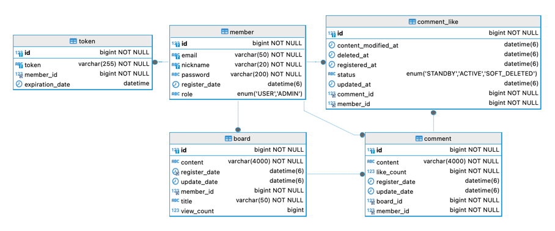
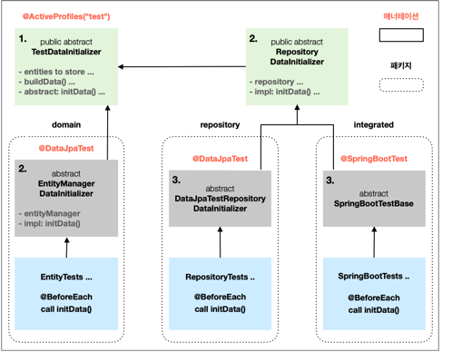
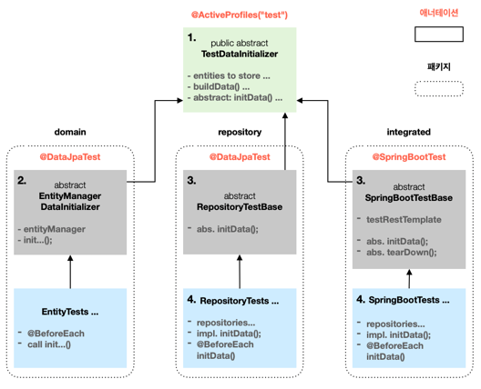
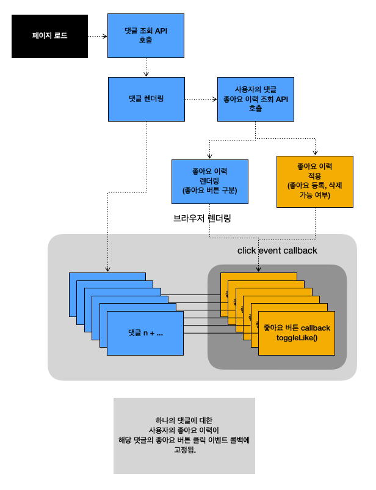
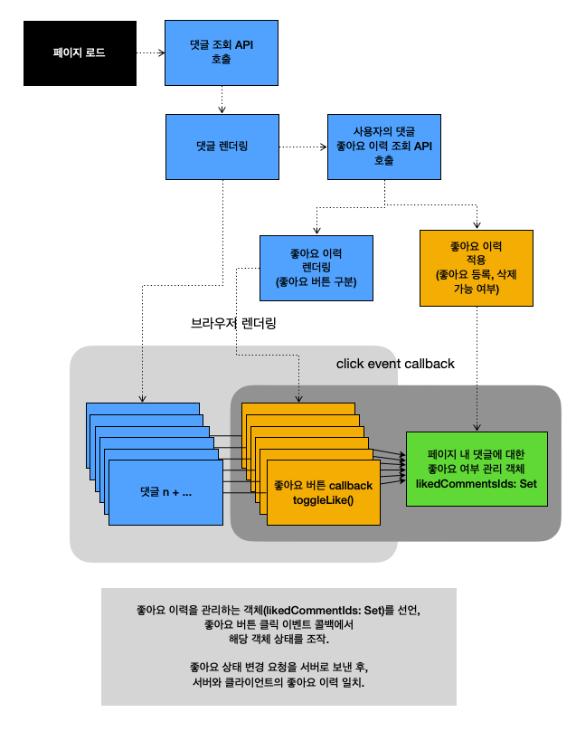

> 문서 업데이트: 2024-09-18

## 목차

1. [소개](#소개-intro)
2. [사용 기술](#사용-기술-skills)
3. [구조](#구조-architecture)
4. [개체간 관계도](#개체간-관계도-erd)
5. [기능](#기능-features)
    1. [Application](#application)
    2. [Web Server](#web-server)
6. [테스트](#테스트-test)
7. [개선의 경험](#개선의-경험-experience-of-improvement)
    1. [테스트 환경 개선](#테스트-환경-개선)
        1. [속도 개선](#속도-개선)
        2. [테스트 데이터 생명 주기 관리 전략](#테스트-데이터-생명-주기-관리-전략) (2024-08-26 수정)
8. [해프닝](#해프닝)

소개 (Intro)
---
회원, 인증, 게시물, 댓글 기반 게시판 서비스로, 개인 풀스택 프로젝트입니다.   
REST 구조에 따라 API 를 설계, 구현했습니다.   
<sup>2024.02 - 현재 진행 중.</sup>   

[서비스 이용해 보기](https://flyin-heron.duckdns.org)

사용 기술 (Skills)
---

* Back-End: Java, Spring Boot, Spring Data JPA
* Database: MySQL
* DevOps: Nginx, Git
* Front-End: HTML, CSS, BootStrap, JavaScript

구조 (Architecture)
---


<div dir="rtl">
  <a href="#목차">목차로 돌아가기</a>
</div>

개체간 관계도 (ERD)
---


<div dir="rtl">
  <a href="#목차">목차로 돌아가기</a>
</div>

기능 (Features)
---

### Application

##### Entity

* 회원 <small>member</small>
    - 가입, 로그인
        - 가입 시, 각 `<input>` 유효성 검사.
        - 모든 조건을 만족하는지 사용자 입력마다 반응해 `<submit>` 활성화. (서버에서 2차 검증)
    - 게시물, 댓글 '조회' 외의 기능에 대한 인가. `@PreAuthorize`

* 토큰 <small>token</small>
    - 매일 특정 시간에 Database 조회, 만료된 Refresh token 삭제 및 로그아웃 처리.
    - 인가가 필요한 end-point 요청 시, 헤더에 Access token 을 담아 요청.
        - 만료되지 않은 경우, 인가 및 요청 처리.
        - 만료된 경우 ,리프레시 토큰으로 재요청, Database 조회,
            - 유효한 Refresh token 이고,
                - 이 토큰의 만료시점 까지 7일 넘게 남았다면 Access token 재발급.
                - 7일 이내이면 Access / Refresh token 재발급.

* 게시물 <small>board</small>
    - 목록 페이지네이션 (`Page`).
    - 등록, 조회, 수정, 삭제.
    - 쿠키 기반 조회수 관리.

* 댓글 <small>comment</small>
    - 목록 더 불러오기 (`Slice`).
    - 등록, 조회, 수정, 삭제.
    - 좋아요 기능
      - 버튼 클릭 마다 서버에 요청을 보내면 요청 수가 많아질 것을 대비.
        - 클라이언트에서 댓글에 대한 최종 좋아요 상태를 기록, 
        - 페이지를 떠날 때, 기존 상태와 다른 좋아요 기록 일괄 서버로 요청.

##### Global

* 예외 처리
    - 서비스 중 일어날 수 있는 예외를 대비해, 상황에 알맞는 HTTP 상태 코드와 메시지를 본문에 담아 응답.    
      ---> 정상 응답 `DTO` 에도 포함 된 필드로, 프론트 측 서버 API 호출 메서드 재사용에 효과적.

* 필터 계층
    - WAS 로 향하는 HTTP 요청 로깅.
    - JWT 인증 시 일어날 수 있는 `JwtException` 처리하는 객체 등록.

<div dir="rtl">
  <a href="#목차">목차로 돌아가기</a>
</div>

### Web Server

##### Nginx

* 요청 헤더 `User-Agent`, `Connection` 기반 최소한의 무차별 / 비정상 요청에 `444` 상태 코드 응답.
* 정적 자원 반환 및 `Cache-Control` 지시.
* 정적 자원을 제외한, 서버로 향하는 모든 접근 로깅.

<div dir="rtl">
  <a href="#목차">목차로 돌아가기</a>
</div>

테스트 (Test)
---

Controller, Service, Repository 계층별 / 통합 테스트. 다음의 경우에 유용하게 사용 중입니다.

* 신규 기능 도입 시 기능의 작동 원리, 구조에 대한 지식이 확실하지 않은 부분의 확인.
* 기능 구현, 리팩토링 후, 의도대로 작동하는 지 확인.

<div dir="rtl">
  <a href="#목차">목차로 돌아가기</a>
</div>

개선의 경험 (Experience of Improvement)
---

### 테스트 환경 개선

#### 속도 개선

기능 개발과 코드 리팩토링에 테스트가 주는 안정감을 느끼고 적극 이용 중입니다.


##### 배경

- 여러 테스트를 묶어 실행 시, `id` 생성 전략에 따른 `id` 값의 증가로 리터럴 `id` 를 통한 엔티티 참조 시, `NoSuchElementException` 발생하는 문제.
- 이전 문제를 해결하고자 `@DirtiesContext` 애너테이션 도입 후, 테스트 소요 시간 증가.

##### 해결 방안

- 상속을 통해 상위 클래스 필드로 선언 및 초기화한 엔티티를 통해 `id` 접근.
- 상위 클래스에서의 테스트 데이터 초기화 관장. 및 `@DirtiesContext` 제거

##### 결과

- 상속을 통해 데이터 초기화, 인스턴스 생성 등 공통적 요소를 효과적으로 관리할 수 있게 됐습니다.
- 테스트 실행 순서에 상관없이 초기화된 데이터를 참조할 수 있게 됐습니다.
- 컨텍스트 로드 횟수를 1회로 줄여, **테스트 수행 시간을 63% 정도 단축**할 수 있었습니다.

<div dir="rtl">
  <a href="#목차">목차로 돌아가기</a>
</div>

#### 테스트 데이터 생명 주기 관리 전략

(2024-08-26 수정) [커밋](https://github.com/gosqo/manidues/commit/4460b5f9f9efe3a3a4ab6460dcb42458821aa25a)

###### 배경

현재 프로젝트에는 총 87 개의 테스트가 존재합니다.
이들 중, 데이터베이스에 의존하고, 데이터를 필요로 하는 테스트는 39 개입니다.
이 테스트들이 사용하는 데이터의 생명 주기 관리 코드를 효율적으로 관리하고자 했습니다.

##### 이전 구조

<details>

###### 방안

* 테스트 데이터로 사용할 **엔티티 생성 역할**을 담당하는 최상위 추상 클래스 선언.
    - ~~생성한 **데이터를 저장하는 행위를 추상화**.~~ 2024-08-26 변경
* ~~최상위 클래스를 상속하여, **계층별 데이터 저장 주체에 따라** 각각 데이터 저장 행위의 구현.~~ 
* 테스트 클래스가 사용하는 **컨텍스트에 따라**, 상속한 필드, 데이터 저장 행위를 통한 데이터 초기화.

###### 개선 이후, 테스트 클래스 상속 구조



<small style="text-align: center; display: block;"></small>

1. `TestDataInitializer` (데이터 생성)
    - 테스트에 필요한 데이터를 생성하는 역할을 수행합니다.
    - 생성한 데이터를 데이터베이스에 저장하는 행위를 추상화한 명세를 제공합니다.
2. `EntityManagerDataInitializer`, `RepositoryDataInitializer` (데이터 저장 주체 분리)
    - `TestDataInitializer` 를 상속받는 두 객체는 상위 객체에서 생성한 데이터를 데이터베이스에 저장하는 행위를 각각 
    `EntityManager`, `JpaRepository`를 통해 구현합니다.
3. `DataJpaTestRepositoryDataInitializer`, `SpringBootTestBase` (컨텍스트 분리)
    - `JpaRepository` 를 사용해 데이터를 저장하는 경우는 두 가지의 컨텍스트로 나누어집니다.
        - 데이터베이스 관련으로 한정된 컨텍스트
        - 앱 전체 컨텍스트
    - 상위 객체가 제공하는 데이터 저장 행위를 각각 다른 컨텍스트에서 사용할 수 있습니다.

위와 같이 역할에 따라 계층을 분리하고, 용도에 따라 구현을 분리,
테스트 클래스가 요구하는 각 맥락에서 필요한 상위 클래스를 상속해, 데이터 저장 메서드를 호출하면,
테스트 데이터 생명주기를 효율적으로 관리할 수 있습니다.

###### 결과

각 클래스가 가지는 역할이 명확해짐으로 코드의 관리가 용이해졌습니다.

* 각 계층별 상위 클래스에서 담당해 3 곳으로 흩어져있던 엔티티 생성 코드를 1개의 클래스에서 담당하게 됐습니다.
* `JpaRepository`, `EntityManager`를 통한 영속화 메서드를 오버라이딩 해,
  해당 클래스를 상속하면 `...Repository,` `entityManager` 필드를 사용할 수 있습니다.
* 테스트 클래스에서는 데이터 초기화, 데이터 관련 필드의 코드 없이 테스트 코드에 집중할 수 있습니다.

######

</details>

##### 변경된 구조

###### 변경 배경

새로운 기능을 추가하면서 신규 `JpaRepository` 객체를 사용하기 위해 `RepositoryDataInitializer`에 의존성을 추가하면서,
해당 객체를 상속하는 모든 하위 클래스에 해당 필드의 **의존성 주입이 강제됐습니다**.   
또한 다수의 클래스에서 직접 사용하지 않는 `repository` 객체에 의존하고 있어 테스트 추가 시 의존성 정리가 복잡할 것으로 예상해 구조를 변경했습니다.   
이것은 OCP, ISP principle 을 위배하는 코드였습니다.

###### 변경 내용

* 사용하지 않는 객체 의존을 강제하는 `RepositoryDataInitializer` 를 제거합니다.
* `repository`를 통해 데이터를 저장하는 경우, 최하위 개별 테스트에서 사용할 `repository`만 필드로 선언, 테스트에 필요한 데이터만을 저장합니다.
* `@SpringBootTest`의 경우, 하위 클래스에서 공통으로 사용하는 `TestRestTemplate` 객체만 `SpringBootTestBase` 필드로 선언해둡니다.



1. `TestDataInitializer` (데이터 생성)
    * 테스트에 필요한 데이터를 생성하는 역할을 수행합니다.
2. `EntityManagerDataInitializer` (데이터 영속화)
    * 상위 객체에서 생성한 데이터를 EntityManager 를 통해 데이터베이스에 저장합니다.
    * 해당 객체를 상속해 필요한 데이터 저장 메서드를 사용합니다.
3. `RepositoryTestBase`, `SpringBootTestBase` (컨텍스트 분리)
    * `JpaRepository` 를 사용해 데이터를 저장하는 경우는 두 가지의 컨텍스트로 나누어집니다.
        * 데이터베이스 관련으로 한정된 컨텍스트
        * 앱 전체 컨텍스트
4. `JpaRepository` 를 사용하는 개별 테스트 클래스 (데이터 영속화 및 테스트)
    * 테스트에 사용할 `repository`객체를 주입하고, 상위 객체에서 생성한 데이터 중 필요한 것들만 영속화해서 테스트에 사용합니다.

위와 같은 계층별 역할 분리를 통해 개별 테스트 클래스에서 필요한 데이터를 효과적으로 초기화할 수 있습니다.

###### 결과

* `JpaRepository`를 사용해 데이터를 영속화하는 경우, 테스트 클래스가 사용하지 않는 객체에 대한 의존을 제거했습니다.
* 새로운 기능 추가에 기존 코드가 영향 받지 않습니다.

##### 알게 된 점

* 상위 객체에서 필드를 선언하면, 하위객체에서는 이에 대한 **의존이 강제됩니다**. 역할에 따라 공통으로 필요한 요소만 상위 객체에 선언하는 것이 좋겠습니다.
* OOP 설계 원칙을 상기하며 코드를 짜는 습관을 들여야겠습니다.
* 엔티티 테스트 중, 엔티티의 상위 클래스 protected 메서드에 접근하기 위해 패키지 구조를 조정할 필요가 있었습니다.
  이로 인해 접근 제어자와 프로덕션-테스트 패키지 구조를 동일하게 가져가는 것의 이유를 체감하게 됐습니다.
* `@SpringBootTest` 애너테이션의 경우, `SpringBootTest.WebEnvironment.RANDOM_PORT`로 지정한 여러 테스트를 묶어 실행할 때,
  테스트 마다 Bean 으로 등록된 인스턴스를 `final`로 선언하더라도 컨텍스트 로딩 시 등록한 인스턴스를 공유하는 것을 알 수 있었습니다.

이에 스프링의 구조에 대해 관심 갖고 학습 중입니다.

<div dir="rtl">
  <a href="#목차">목차로 돌아가기</a>
</div>

### 상속 활용하기

테스트 코드에 친숙해지며, 상속의 이점을 체감 후, 신규 기능 도입에도 적용,   
`BaseEntity`를 추상 클래스로 등록, 엔티티가 기본적으로 가지는 필드를 관리.   
엔티티 상태 초기화는 엔티티 성격에 따라 달라지므로 추상 메서드로 선언하고, 하위 클래스에서 구현.

### 댓글 좋아요 기록과 브라우저 히스토리

* [작업내역1](https://github.com/gosqo/manidues/commit/4b2c93c56f536e4f06e93833d8d487b6f2356c73)
* [작업내역2](https://github.com/gosqo/manidues/commit/4e4d769696abacf0eda154c362ba4e386de7741f) (모바일에서 지원되지 않는 beforeunload 이벤트 수정 포함)

#### 배경

댓글 좋아요 기능 추가 후, 사용자가 기대하는 좋아요 상태와 서버의 좋아요 상태가 불일치하는 버그를 발견했습니다.

버그가 일어나는 사용 사례는

* 특정 댓글에 좋아요 기능 사용 후, 
* 브라우저의 '뒤로 가기', '앞으로 가기', 기존 좋아요 기록 수정

하는 경우입니다.

문제가 발생한 기존의 코드와 동작은 다음과 같습니다.



* `CommentLike.toggleLike()` 는 각 댓글이 DOM 조작을 통해 렌더링할 때, 좋아요 이력을 불러오는 메서드로 조회한 사용자의 해당 댓글 좋아요 여부를 인자로 넘깁니다.
  * 이 좋아요 여부는 좋아요 버튼 클릭 이벤트에 고정됩니다.
* 기존 상태와 달라진 좋아요 등록, 삭제 대상 `id`를 `pendingCommentLikes 인스턴스의 idsToRequest: Set`에 담아둡니다.
* 페이지를 떠날 때, 일괄적으로 `pendingCommentLikes 인스턴스의 request()`를 통해 서버로 요청을 보냅니다. 

```javascript
class PendingCommentLikes {
    constructor(feat, ajax) {
        this.feat = feat;
        this.ajax = ajax;
        this.idsToRequest = new Set();
    }

    // ... idsToRequest 조작 메서드 ...

    request() {
        this.idsToRequest.forEach((id) => {
            this.ajax(id);
        });
    }
}

export class CommentLike {
    static pendingLikesToRegister = new PendingCommentLikes("register", this.registerCommentLike);
    static pendingLikesToDelete = new PendingCommentLikes("delete", this.removeCommentLike);

    static toggleLike(commentId, hasLiked) {
        const commentLikeButton = document.getElementById(`comment-${commentId}-like-button`);
        const commentLikeImage = commentLikeButton.querySelector("img");
        const commentLikeCount = commentLikeButton.nextElementSibling;

        // 해당 댓글에 좋아요를 하지 않은 상태라면
        if (commentLikeImage.src.includes("unchecked")) {
            
            // 
            commentLikeImage.src = "/img/icons/checked.png";
            commentLikeCount.textContent = parseInt(commentLikeCount.textContent) + 1;

            // 좋아요 기록이 없으면 등록할 대상으로 추가.
            if (!hasLiked) {
                this.pendingLikesToRegister.add(commentId);
            }

            // 좋아요 삭제 대상이라면 삭제 대상에서 제거.
            if (this.pendingLikesToDelete.contains(commentId)) {
                this.pendingLikesToDelete.remove(commentId);
            }

            return;
        }

        commentLikeImage.src = "/img/icons/unchecked.png";
        commentLikeCount.textContent = parseInt(commentLikeCount.textContent) - 1;

        if (hasLiked) {
            this.pendingLikesToDelete.add(commentId);
        }

        if (this.pendingLikesToRegister.contains(commentId)) {
            this.pendingLikesToRegister.remove(commentId);
        }
    }
    
    // ... methods ...
}
```

#### 원인

버그가 발생하는 원인은 다음과 같았습니다.

* 좋아요 버튼 클릭 이벤트 콜백인 `toggleLike(commentId, hasLiked)` 함수에 사용자의 해당 댓글 좋아요 여부가 고정됩니다.
  * 이것으로 인해, 좋아요 이력을 불러오는 메서드를 새로 호출하기 전까지, 브라우저에서의 사용자의 해당 댓글 좋아요 여부는 바뀌지 않습니다.
    * 좋아요를 한 적이 없는 경우, 좋아요 등록 대상으로 고정되고, 삭제 대상에 포함될 수 없게 됩니다. (반대의 경우도 마찬가지)
* 서버에 등록 요청을 보낸 후, 사용자는 실제 좋아요 기록이 있지만, 해당 댓글에 좋아요를 취소하더라도 
브라우저는 좋아요 기록이 없기 때문에 좋아요 취소 요청을 만들지 못했습니다.

#### 해결 방안

문제를 해결하기 위해서는 좋아요 등록•삭제 요청에 따라 실제 좋아요 어부를 브라우저에서도 관리하기로 했습니다.



* 좋아요한 댓글의 `id`를 담을수 있는 필드(`likedCommentIds: Set`)를 선언.
* 페이지 최초 로드 시, 사용자가 좋아요한 댓글의`id`를 `likedCommentIds`에 추가.
    * 댓글에 좋아요 조작 시, `likedCommentIds`에 해당 댓글의 존재여부를 기반으로 서버에 보낼 좋아요 상태 선별.
* 댓글 좋아요 등록•삭제 요청을 보낼 때,
    * 등록 요청에 포함된 `id`를 `likedCommentIds`에 저장.
  * 삭제 요청에 포함된 `id`를 `likedCommentIds`에서 삭제.
* 더불어 요청을 보낸 후, 댓글 좋아요 등록•삭제할 `id`를 담는 `PendingCommentLikes 인스턴스 필드 idsToRequest`를 비움.

수정 사항은 다음과 같습니다.


```javascript
class PendingCommentLikes {
    constructor(feat, ajax) {
        this.feat = feat;
        this.ajax = ajax;
        this.idsToRequest = new Set();
    }

    // ... idsToRequest 조작 메서드 ...

    request() {
        this.idsToRequest.forEach((id) => {
        
            // 등록 요청을 보냈다면, 좋아요한 댓글 목록에 추가.
            if (this.ajax.name === "registerCommentLike") {
                CommentLike.likedCommentIds.add(id);
            }

            // 삭제 요청을 보냈다면, 좋아요한 댓글 목록에서 삭제.
            if (this.ajax.name === "removeCommentLike") {
                CommentLike.likedCommentIds.delete(id);
            }

            this.ajax(id);
            this.remove(id); // 등록•삭제 요청한 `id`는 idsToRequest 에서 삭제.
        });
    }
}

export class CommentLike {
    static likedCommentIds = new Set(); // 추가. 브라우저에서 사용자의 좋아요 이력을 관리.
    static pendingLikesToRegister = new PendingCommentLikes("register", this.registerCommentLike);
    static pendingLikesToDelete = new PendingCommentLikes("delete", this.removeCommentLike);

    static toggleLike(commentId) {
        const commentLikeButton = document.getElementById(`comment-${commentId}-like-button`);
        const commentLikeImage = commentLikeButton.querySelector("img");
        const commentLikeCount = commentLikeButton.nextElementSibling;

        if (commentLikeImage.src.includes("unchecked")) {
            commentLikeImage.src = "/img/icons/checked.png";
            commentLikeCount.textContent = parseInt(commentLikeCount.textContent) + 1;

            // 사용자 좋아요 이력에 해당 id가 없다면 등록 대상에 추가
            if (!this.likedCommentIds.has(commentId)) {
                this.pendingLikesToRegister.add(commentId);
            }

            if (this.pendingLikesToDelete.contains(commentId)) {
                this.pendingLikesToDelete.remove(commentId);
            }

            return;
        }

        commentLikeImage.src = "/img/icons/unchecked.png";
        commentLikeCount.textContent = parseInt(commentLikeCount.textContent) - 1;

        // 사용자 좋아요 이력에 해당 id가 있다면 삭제 대상에 추가
        if (this.likedCommentIds.has(commentId)) {
            this.pendingLikesToDelete.add(commentId);
        }

        if (this.pendingLikesToRegister.contains(commentId)) {
            this.pendingLikesToRegister.remove(commentId);
        }
    }
    
    // ... methods ...
}

```

#### 결과 및 느낀 점

위처럼 수정을 통해, 해당 문제를 해결할 수 있었습니다.

* 브라우저 히스토리 동작으로 예상치 못한 버그가 발생할 수 있음을 유념해야겠습니다.
* 하나의 페이지 내에서 서버 자원의 상태를 변경하는 요청을 보낸다면, 해당 자원의 변경된 상태를 반영해야합니다.
* 서버에 상태 조회 요청하거나, 클라이언트 수준에서 객체를 관리하는 방법 중 선택해, 사용자에게 일관된 정보를 전달할 수 있습니다.
* 서버 로직이 복잡하거나, 예외 발생 위험이 높은 경우, 실제 서버에 요청을 보내는 것이 좋을 것이고,
* 로직이 간단하고, 예외 발생 가능성이 적은 경우, 클라이언트 측에서 간단히 이 문제를 해결할 수 있었습니다.
* 위 사례의 경우, 클라이언트 측 객체 추가로 서버와 클라이언트가 참조하는 자원의 상태 차이를 제거할 수 있었습니다.

### Shell Script 작성을 통한 1줄 배포

생각보다 잦은 프로젝트 업데이트에 단순 반복적 배포 작업을 자동화.   
--> 배포 서버의 Shell Script 를 통한 패치, 빌드, 배포.

해프닝
---

* 의도와 다르게 삭제된 배포 서버 데이터를 MySQL binlog 기반 복구한 경험이 있습니다.
    - 삭제 원인은 충분치 않은 테스트 케이스.
    - 이 경험을 통해 테스트 작성 시, 하나의 성공에 대해 반대 케이스의 중요성을 인식.
    - `.bat` 스크립트를 작성 해 데이터베이스 데이터, 로그의 백업.

<div dir="rtl">
  <a href="#목차">목차로 돌아가기</a>
</div>
